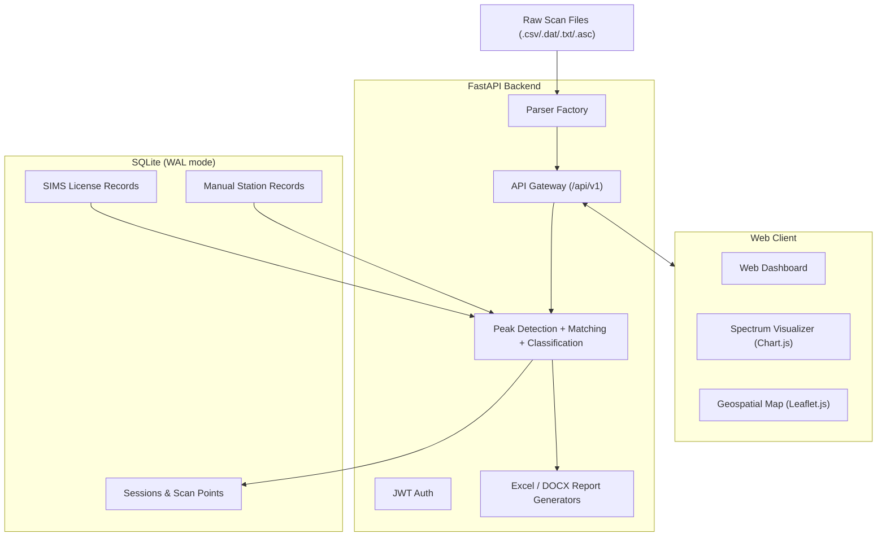

# AI Spectrum Identifier & Monitoring System

[](https://www.python.org/)
[](https://fastapi.tiangolo.com)
[](#)

An automated radio frequency spectrum monitoring and identification platform built for **Balai Monitor Spektrum Frekuensi Radio Kelas I Yogyakarta (Balmon SFR Kelas I Yogyakarta)**, under the **Directorate General of Resources and Equipment of Post and Information Technology (Ditjen SDPPI) / Ministry of Communication and Digital Affairs (Komdigi), Republic of Indonesia**.

The system ingests spectrum scans from multiple hardware analyzers, correlates detected emissions against the national licensing database (SIMS) and local station records, classifies regulatory compliance status, provides interactive geospatial and spectrum visualizations, and generates official field monitoring reports (Excel/DOCX/PDF).

---

## 📑 Table of Contents

- [Key Features](#-key-features)
- [System Architecture](#-system-architecture)
- [Compliance Classification](#-compliance-classification)
- [Supported Equipment & Parsers](#-supported-equipment--parsers)
- [Tech Stack](#-tech-stack)
- [Installation](#-installation)
- [Running the Application](#-running-the-application)
- [Operational Workflow](#-operational-workflow)
- [API Documentation](#-api-documentation)
- [Notes on Local Database](#-notes-on-local-database)
- [Maintainers](#-maintainers)

---

## 🚀 Key Features

- **Multi-format scan ingestion** — auto-detects and parses raw measurement files from major spectrum analyzers (TCI, Rohde & Schwarz Argus, LS Telecom, Anritsu, Keysight/Agilent), extracting frequency, level, and sweep metadata.
- **Identification engine** — peak detection separates real emissions from noise; O(log N) binary-search + Haversine geodesic matching correlates millions of scan points against thousands of licensed stations in milliseconds.
- **Regulatory classification** — automatically tags each detection as Legal, Expired, Off Air, Unknown, Parameter Mismatch, Unlicensed, International, or Clear.
- **Interactive visualization** — Chart.js spectrum view (field strength vs. frequency) and a Leaflet.js map of stations, detection radii, and transmitter locations, with built-in station presets and reverse-geocoding.
- **Automated reporting** — one-click export of standardized ROL (Resume Operasional Lapangan) Excel spreadsheets and official DOCX/PDF inspection reports.

---

## 🏗 System Architecture



---

## 📊 Compliance Classification

| Status | Meaning |
|---|---|
| **Legal** | Signal matches an active, unexpired license within radius. |
| **Kadaluarsa (Expired)** | Signal matches a license, but it has expired. |
| **Off Air** | Licensed station exists, but no signal detected above threshold. |
| **Belum Diketahui (Unknown)** | Active signal with no matching license found. |
| **Tidak Sesuai ISR (Mismatch)** | Frequency, emission, or coordinate deviates from the license. |
| **Ilegal (Unlicensed)** | Confirmed unauthorized transmission. |
| **Internasional** | Falls under ITU international allocation. |
| **Clear** | No significant emission above threshold. |

---

## 📻 Supported Equipment & Parsers

| Manufacturer | Formats | Notes |
|---|---|---|
| TCI International | `.csv` `.txt` `.dat` | Scorpio / spectrum monitoring suites |
| Rohde & Schwarz | `.csv` `.asc` `.txt` | Argus 5.x / 6.x |
| LS Telecom | `.csv` `.txt` | LS OBSERVER, LS306, LS327W |
| Anritsu | `.csv` `.txt` | Spectrum Master (MS2712E, MS2720T, etc.) |
| Keysight / Agilent | `.csv` `.txt` | FieldFox handheld analyzers |
| Generic | `.csv` `.txt` | Auto-detects frequency/level columns |

---

## 💻 Tech Stack

**Backend:** FastAPI · SQLAlchemy · SQLite (WAL mode) · Pydantic · OpenPyXL · python-docx · SciPy/NumPy · Uvicorn

**Frontend:** HTML5 / ES6+ / CSS3 · Chart.js 4.4+ · Leaflet.js 1.9+ · Lucide Icons

---

## ⚙️ Installation

**Requirements:** Windows/Linux/macOS · Python 3.10+ · Node.js 18+ (optional, for frontend dev)

```bash
git clone <repository-url>
cd ai-spectrum-monitoring

python -m venv venv
source venv/bin/activate        # Windows: venv\Scripts\activate

cd backend
pip install fastapi uvicorn sqlalchemy pydantic pydantic-settings \
    python-multipart python-jose[cryptography] passlib[bcrypt] \
    openpyxl python-docx requests scipy numpy
```

---

## 🏃 Running the Application

**Option 1 — 1-click launcher (Windows):** double-click `run_app.bat`, then open `http://127.0.0.1:3000/`.

**Option 2 — Manual CLI:**
```bash
cd backend
python run.py --host 127.0.0.1 --port 3000 --reload
```

**Option 3 — Frontend dev (Vite):**
```bash
# Terminal 1
cd backend && python run.py --port 8000 --reload
# Terminal 2
cd frontend && npm install && npm run dev
```
Then open `http://localhost:3000/`.

> On first launch, default admin/officer accounts are seeded automatically — see the setup docs to change these credentials before deploying anywhere beyond local use.

---

## 🧭 Operational Workflow

1. **Import scan** — upload a scan file, pick a station preset (or enter custom coordinates), fill in session details, and save.
2. **Run identification** — set the target frequency range and threshold, then process; the engine matches every peak against SIMS/manual records and assigns a compliance status.
3. **Analyze** — inspect the spectrum graph and map, filter markers by status (All / Peak Only / Off Air / Unknown).
4. **Export** — generate the ROL Excel summary and/or the official DOCX inspection report.

---

## 📡 API Documentation

Interactive docs are served by FastAPI once the app is running:
- Swagger UI: `http://127.0.0.1:3000/docs`
- ReDoc: `http://127.0.0.1:3000/redoc`

Key endpoints include authentication, scan session upload, reverse-geocoding, the identification process, SIMS station queries/import, and ROL/DOCX report downloads (see `/docs` for the full list and schemas).

---

## 🛡 Notes on Local Database

The app stores its SQLite database on local physical storage (`%LOCALAPPDATA%\BalmonMonitoring\balmon_monitoring.db`) rather than a cloud-synced drive, to avoid file-locking errors on providers like Google Drive. It runs with Write-Ahead Logging (`journal_mode=WAL`) for concurrency and integrity. A custom path can be set via the `DATABASE_URL` environment variable.

---

## 👥 Maintainers

- **Lead Organization:** Balai Monitor Spektrum Frekuensi Radio Kelas I Yogyakarta
- **Parent Agency:** DJID (Direktorat Jenderal Infrastruktur Digital), Kementerian Komunikasi dan Digital RI
- **Version:** 1.0.0

---

*© 2026 Balai Monitor Spektrum Frekuensi Radio Kelas I Yogyakarta. All Rights Reserved.*
